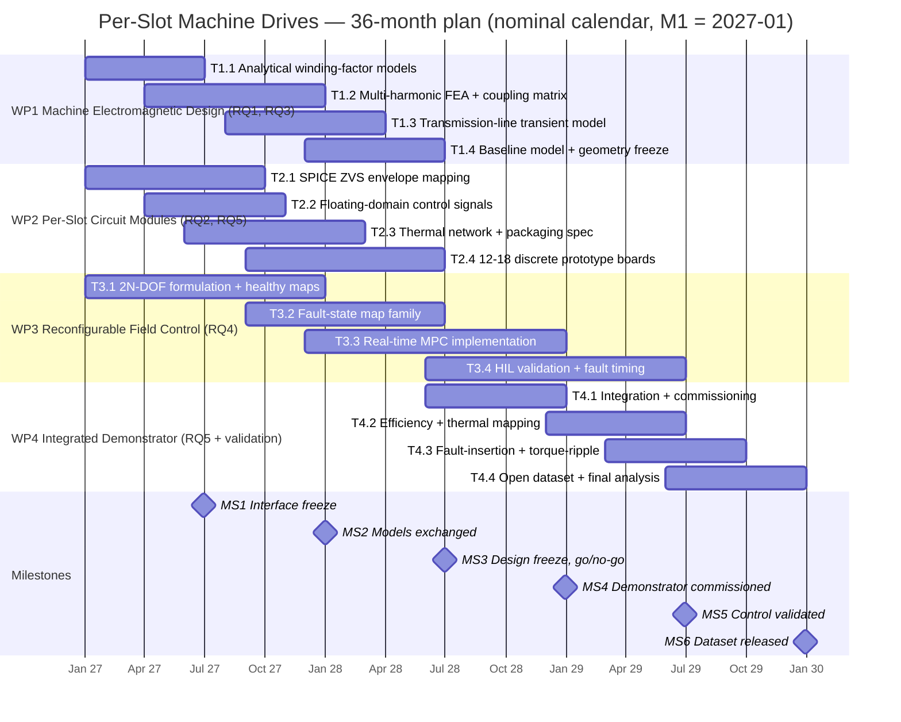

# Project Plan — Diagrammatic Workplan (data source)

[PI TO CONFIRM: task/deliverable/milestone skeleton proposed by drafting team]

This file is the canonical data behind the one-page A4 landscape Gantt chart (`gantt.html`). The Approach section and the Gantt must both draw on the tables below so that work-package (WP) tasks, deliverables and milestones agree verbatim across the proposal.

**Programme:** Foundations of Monolithically Integrated Per-Slot Machine Drives for Reconfigurable Aerospace Propulsion — 36 months, Technology Readiness Level (TRL) 1–3.
**Team:** Principal Investigator (PI) Dr Mehdi Baghdadi (UCL Advanced Propulsion Laboratory); Co-Investigator (Co-I) Dr Pedram Asef; Co-I Dr Marilize Everts; two Postdoctoral Research Associates (PDRA 1, PDRA 2).

## Work packages and tasks

| WP | Task | Description | Months | Lead | Research question (RQ) |
|---|---|---|---|---|---|
| **WP1 — Machine Electromagnetic Design** | | | **M1–M18** | **Co-I Asef + PDRA 2** | **RQ1, RQ3** |
| WP1 | T1.1 | Analytical multi-harmonic winding-factor models | M1–M6 | Co-I Asef + PDRA 2 | RQ1 |
| WP1 | T1.2 | Multi-harmonic finite element analysis (FEA) + inter-slot coupling matrix | M4–M12 | Co-I Asef + PDRA 2 | RQ1, RQ3 |
| WP1 | T1.3 | Distributed-parameter transmission-line transient voltage model | M8–M15 | Co-I Asef + PDRA 2 | RQ3 |
| WP1 | T1.4 | Conventional-baseline model + winding geometry freeze | M12–M18 | Co-I Asef + PDRA 2 | RQ1 |
| **WP2 — Per-Slot Circuit Module Architecture** | | | **M1–M18** | **PI + PDRA 1 + Co-I Everts** | **RQ2, RQ5** |
| WP2 | T2.1 | Simulation Program with Integrated Circuit Emphasis (SPICE)-level zero-voltage-switching (ZVS) envelope mapping under winding-source/back-electromotive-force (back-EMF) conditions | M1–M9 | PI + PDRA 1 | RQ2 |
| WP2 | T2.2 | Floating-domain control-signal architecture | M4–M10 | PI + PDRA 1 | RQ2 |
| WP2 | T2.3 | Thermal resistance network + packaging specification | M6–M14 | Co-I Everts + PDRA 1 | RQ5 |
| WP2 | T2.4 | Build + characterisation of 12–18 discrete functional-equivalent prototype boards | M9–M18 | PI + PDRA 1 | RQ2, RQ5 |
| **WP3 — Reconfigurable Field Control** | | | **M1–M30** | **PI + PDRA 1** | **RQ4** |
| WP3 | T3.1 | 2N-degree-of-freedom (2N-DOF) formulation + offline convex loss maps, healthy state | M1–M12 | PI + PDRA 1 | RQ4 |
| WP3 | T3.2 | Fault-state map family | M9–M18 | PI + PDRA 1 | RQ4 |
| WP3 | T3.3 | Real-time model predictive control (MPC) implementation | M12–M24 | PI + PDRA 1 | RQ4 |
| WP3 | T3.4 | Hardware-in-the-loop (HIL) validation including fault re-optimisation timing | M18–M30 | PI + PDRA 1 | RQ4 |
| **WP4 — Integrated Demonstrator** | | | **M18–M36** | **All investigators + both PDRAs** | **RQ5 + validation of RQ1–RQ4** |
| WP4 | T4.1 | Demonstrator integration + commissioning | M18–M24 | All | RQ5 |
| WP4 | T4.2 | Efficiency + thermal mapping vs WP1 baseline | M24–M30 | All | RQ5 + validation of RQ1 |
| WP4 | T4.3 | Fault-insertion + torque-ripple campaigns | M27–M33 | All | Validation of RQ2–RQ4 |
| WP4 | T4.4 | Open dataset + final analysis | M30–M36 | All | Validation of RQ1–RQ4 |

## Deliverables

| Deliverable | Description | Month |
|---|---|---|
| D1.1 | Candidate winding geometries + WP1–WP2 interface parameter set | M6 |
| D1.2 | Validated multi-harmonic electromagnetic model | M12 |
| D1.3 | Per-slot voltage/transient characterisation + coupling matrix handed to WP3 | M15 |
| D1.4 | Build-ready winding geometry + modelled conventional baseline | M18 |
| D2.1 | ZVS envelope map | M9 |
| D2.2 | Floating-domain control-signal architecture specification | M10 |
| D2.3 | Validated thermal model + packaging specification | M14 |
| D2.4 | Characterised per-slot drive cells | M18 |
| D3.1 | 2N-DOF formulation + healthy-state loss maps | M12 |
| D3.2 | Fault-state loss maps | M18 |
| D3.3 | Real-time MPC implementation | M24 |
| D3.4 | HIL-validated controller + quantified re-optimisation response | M30 |
| D4.1 | Demonstrator commissioned | M24 |
| D4.2 | Efficiency/thermal dataset | M30 |
| D4.3 | Fault + torque-ripple characterisation | M33 |
| D4.4 | Open dataset released | M36 |

## Milestones

| Milestone | Description | Month |
|---|---|---|
| MS1 | WP1–WP2 interface parameter freeze | M6 |
| MS2 | Validated models exchanged across WPs | M12 |
| MS3 | Design freeze and integration go/no-go | M18 |
| MS4 | Demonstrator commissioned | M24 |
| MS5 | Control validated on hardware | M30 |
| MS6 | Dataset released, programme complete | M36 |

## Dependencies

WP1 and WP2 run in parallel from month 1, exchanging parameterised interface models at MS1 and validated models at MS2. WP3 begins analytical formulation from month 1 using parameterised placeholder models, and consumes validated WP1 and WP2 outputs as they arrive. Only WP4 is dependent: it starts at M18, gated by the MS3 design freeze and integration go/no-go. The programme therefore contains no sequential chain of work packages — three of the four strands are live from the first month.

## Mermaid preview (quick render only — not the submission graphic)

Calendar dates below are nominal (M1 mapped to 2027-01) purely because the Mermaid gantt renderer requires dates. [PI TO CONFIRM: actual project start date.]

*[Word count: 1,126]*
